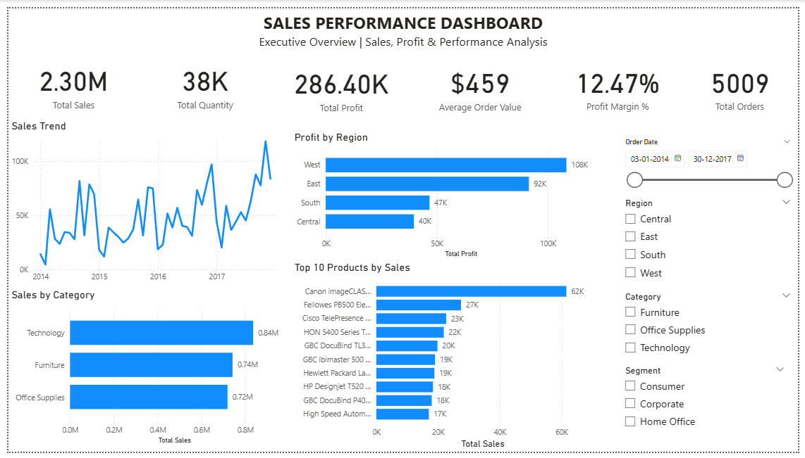
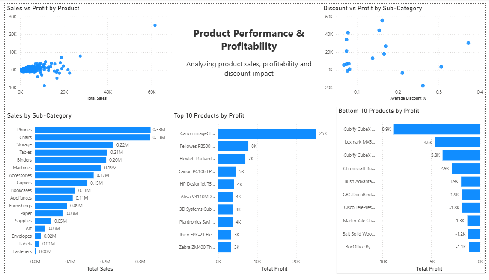
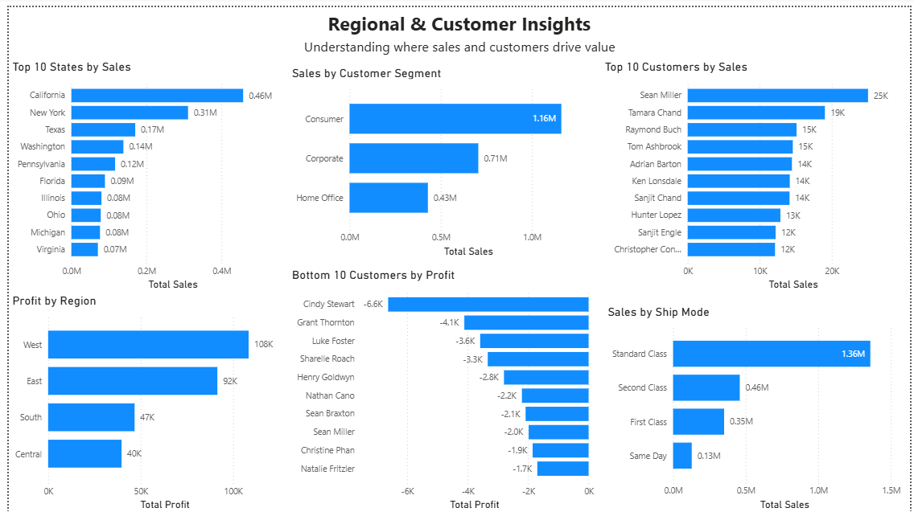

# FUTURE_DS_01

# Business Sales Performance Analytics Dashboard

**Future Interns – Data Science & Analytics Task 1**

A professional Power BI dashboard designed to analyze business sales, profitability, product performance, regional performance, customer behavior, and discount impact.

---

## 📌 Project Overview

This project was developed as part of the **Future Interns Data Science & Analytics – Task 1: Business Sales Performance Analytics**.

The objective was to transform raw business sales data into a professional, interactive dashboard that helps business stakeholders understand sales performance, profitability, product performance, regional performance, customer contribution, and discount impact.

The project follows a complete analytics workflow:

**Raw Sales Data → Data Cleaning → Data Preparation → KPI Analysis → Trend Analysis → Performance Analysis → Insights → Recommendations**

---

## 🎯 Business Problem

Businesses generate large amounts of transactional sales data, but raw data alone does not provide clear business insights.

This project focuses on answering important business questions such as:

- Which products generate the most sales?
- How do sales change over time?
- Which categories perform best?
- Which regions are most profitable?
- Which products generate negative or low profit?
- Which customer segments contribute the most revenue?
- How do discounts relate to profitability?
- Where should the business focus to improve performance?

---

## 🎯 Project Objectives

The main objectives of this project were to:

1. Clean and organize raw sales data.
2. Analyze revenue performance over time.
3. Identify top-selling products.
4. Analyze category and sub-category performance.
5. Analyze regional performance.
6. Evaluate business profitability.
7. Develop meaningful business KPIs.
8. Identify high- and low-performing products.
9. Analyze customer and segment performance.
10. Generate actionable business insights.
11. Present the analysis through a professional, client-ready dashboard.

---

## 📊 Dataset

### Dataset Used

**Superstore Sales Dataset**

The dataset represents a retail business scenario containing transactional information related to:

- Orders
- Customers
- Products
- Categories
- Sub-Categories
- Regions
- States
- Sales
- Quantity
- Discount
- Profit
- Shipping information

The dataset was suitable for analyzing sales, revenue, profitability, product, regional, customer, and discount-related performance.

---

## 🧹 Data Cleaning & Preparation

Data preparation was performed using **Power Query in Microsoft Power BI**.

The preparation process included:

- Data type validation
- Missing-value review
- Duplicate-record review
- Inconsistent-value review
- Numerical field validation
- Preparation of the cleaned dataset for analysis

Important fields were validated with appropriate data types, including:

| Field | Data Type |
|---|---|
| Order Date | Date |
| Ship Date | Date |
| Sales | Decimal |
| Profit | Decimal |
| Quantity | Whole Number |
| Discount | Decimal |

---

## 🛠️ Tools & Technologies

- **Microsoft Power BI**
- **Power Query**
- **DAX**
- **GitHub**
- **Superstore Sales Dataset**

---

# 📈 Dashboard

The final Power BI dashboard consists of **three analytical pages**:

**Executive Overview → Product Analysis → Regional & Customer Analysis**

---

## 1️⃣ Sales Performance Dashboard

The first page provides an executive-level overview of overall business performance.

### Key KPIs

- **Total Sales:** 2.30M
- **Total Profit:** 286.40K
- **Total Quantity:** 38K
- **Average Order Value:** $459
- **Profit Margin:** 12.47%
- **Total Orders:** 5,009

### Visualizations

- Sales Trend
- Sales by Category
- Profit by Region
- Top 10 Products by Sales

### Interactive Filters

- Order Date
- Region
- Category
- Segment

This page provides a high-level view of overall business performance and allows stakeholders to explore the results using interactive filters.

---

## 2️⃣ Product Performance & Profitability

The second page focuses on product-level performance and profitability.

### Visualizations

- Sales vs Profit by Product
- Sales by Sub-Category
- Average Discount vs Profit by Sub-Category
- Top 10 Products by Profit
- Bottom 10 Products by Profit

This page helps identify:

- High-sales and high-profit products
- High-sales but low-profit products
- Loss-making products
- Strong-performing sub-categories
- Potential relationships between discounting and profitability

---

## 3️⃣ Regional & Customer Insights

The third page focuses on geographic, customer, and operational performance.

### Visualizations

- Top 10 States by Sales
- Sales by Customer Segment
- Top 10 Customers by Sales
- Bottom 10 Customers by Profit
- Profit by Region
- Sales by Ship Mode

This page helps stakeholders understand:

- Strong-performing states
- Regional profitability differences
- Customer segment contribution
- High-value customers
- Low-profit customers
- Shipping-mode performance

---

# 🔑 Key Business Insights

### 1. Technology is the leading category by sales

Technology generates approximately **0.84M in sales**, making it the strongest-performing category in the dashboard.

### 2. West is the strongest region by profit

The West region generates approximately **108K in profit**, significantly higher than the South and Central regions.

### 3. Consumer is the largest customer segment

The Consumer segment contributes approximately **1.16M in sales**, making it the largest revenue-contributing segment.

### 4. Standard Class dominates shipping

Standard Class generates approximately **1.36M in sales**, making it the dominant shipping mode in the dataset.

### 5. High sales do not always mean high profitability

The product analysis shows that some products can generate significant sales while producing relatively low or negative profit.

Therefore, products should be evaluated using both **Sales and Profit** rather than revenue alone.

### 6. Discounting requires monitoring

The discount-profit analysis indicates that some highly discounted sub-categories have weak profitability.

This suggests that aggressive discounting should be evaluated carefully to avoid unnecessary margin reduction.

---

# 💡 Actionable Business Recommendations

### 1. Review loss-making products

The business should investigate the **Bottom 10 Products by Profit**.

Factors to review include:

- Pricing
- Product costs
- Discounts
- Demand
- Profit margins

### 2. Optimize discount strategy

Discounts should be aligned with profitability.

Instead of applying aggressive discounts broadly, the business should identify where discounts actually generate profitable additional sales.

### 3. Strengthen high-performing categories

Technology is the leading category by sales.

The business should consider:

- Maintaining stock availability
- Promoting successful products
- Identifying high-margin Technology products

### 4. Investigate weaker regions

South and Central generate substantially less profit than West.

Management should investigate differences in:

- Product mix
- Pricing
- Discounts
- Customer composition
- Sales volume

### 5. Retain high-value customers

Top customers by sales should be identified for targeted customer-retention strategies.

### 6. Evaluate profitability, not just revenue

Business decisions should consider both **sales and profit** to avoid focusing only on high-revenue but low-margin products or customers.

---

# 📌 Business Impact

The dashboard provides a centralized view of business performance and can help stakeholders:

- Monitor sales performance
- Track profitability
- Identify top-selling products
- Identify loss-making products
- Compare regional performance
- Understand customer segments
- Evaluate discounting
- Support business decision-making

The project transforms transaction-level sales data into an interactive format that can be quickly understood by business stakeholders.

---

# 📸 Dashboard Screenshots

## Page 1 – Executive Overview



## Page 2 – Product Performance & Profitability



## Page 3 – Regional & Customer Insights



---

# 📁 Project Structure

```text
FUTURE_DS_01/
│
├── Documentation/
│   └── Project_Documentation.pdf
│
├── Screenshots/
│   ├── Page1_Executive_Overview.png
│   ├── Page2_Product_Performance_Profitability.png
│   └── Page3_Regional_Customer_Insights.png
│
├── README.md
│
└── Sales_Performance_Analytics.pbix
